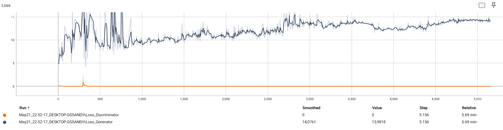

### Домашнее задание 2

Сначала реализован базовый генератор с использованием CSPup-блоков (их структура соответствует заданию). В качестве лосса использовался BCEloss, остальные параметры также не менялись по сравнению с исходными. Обучение длилось 5 эпох по 2000 итераций, на каждой итерации, кратной 200, выводились примеры сгенерированных изображений. Посмотрим на график лосса: 

По графику лосса видно, что также произошел Mode Collapse. Значит, дискриминатор слишком хорошо распознает фейк, так как генерируется в основном шум.

Далее изображения превращаются в черный квадрат спустя несколько сотен итераций.

Затем в качестве функции потерь использован `BCEWithLogitsLoss` и убран слой sigmoid у дискриминатора. Результат - генерируется сначала шум, потом практически полностью черное изображение.  Также для удобства добавлены графики лосса дискриминатора и генератора на одну ось.

По графику лосса видно, что также произошел Mode Collapse.

Попробуем заменить ConvTranspose2d на Upsample. Возможно, ConvTranspose2d создает overhead и влияет на качество генерации. Также заменим ReLU на LeakyRelu, уберем BatchNorm, добавим Dropout. Дискриминатор оставим без изменений.

Получаем более цветной шум, который снова превращается в черное изображение.

Посмотрим на лосс:

В начале была попытка сходимости

Попробуем подавать на вход не матрицу шума, а вектор размерности 100, как показано на схеме. В таком случае получилось сгенерировать лица (один из примеров):

Посмотрим на лосс - наблюдаем практически сходимость на 2-й эпохе

Вывод: существенный прирост в качестве обеспечила генерация шума в виде вектора, а не матриц. 

