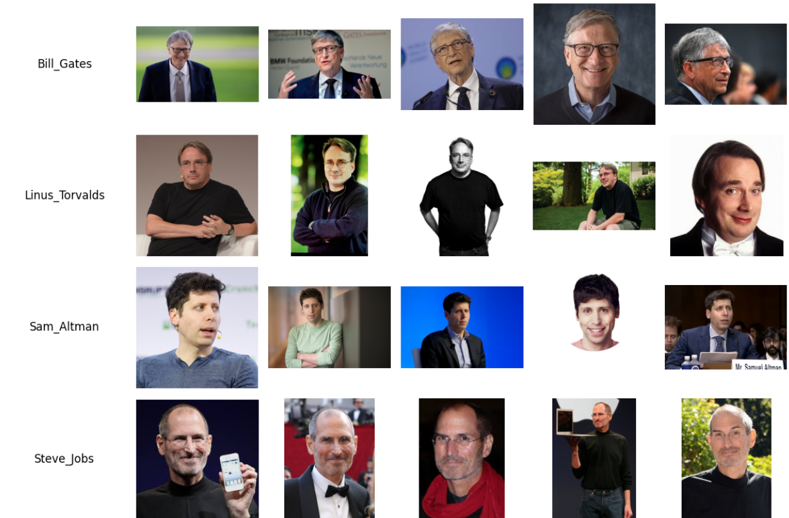
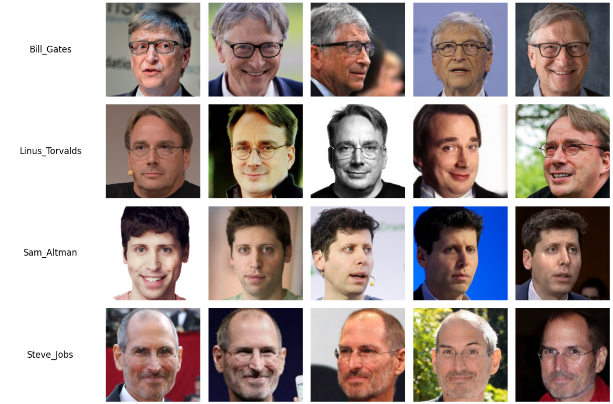
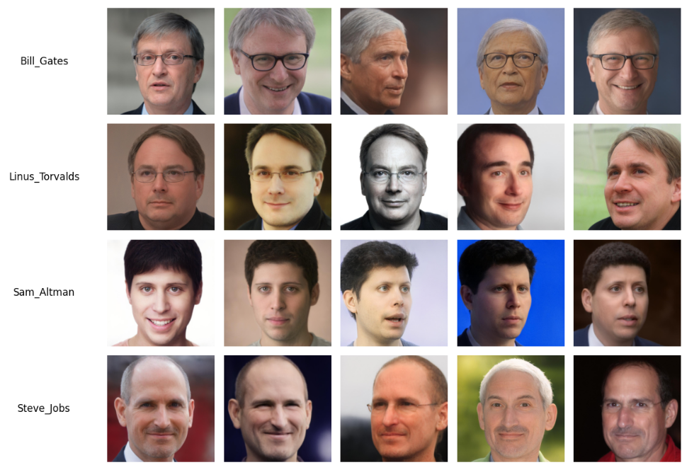
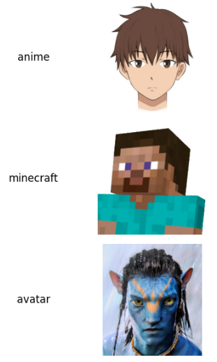
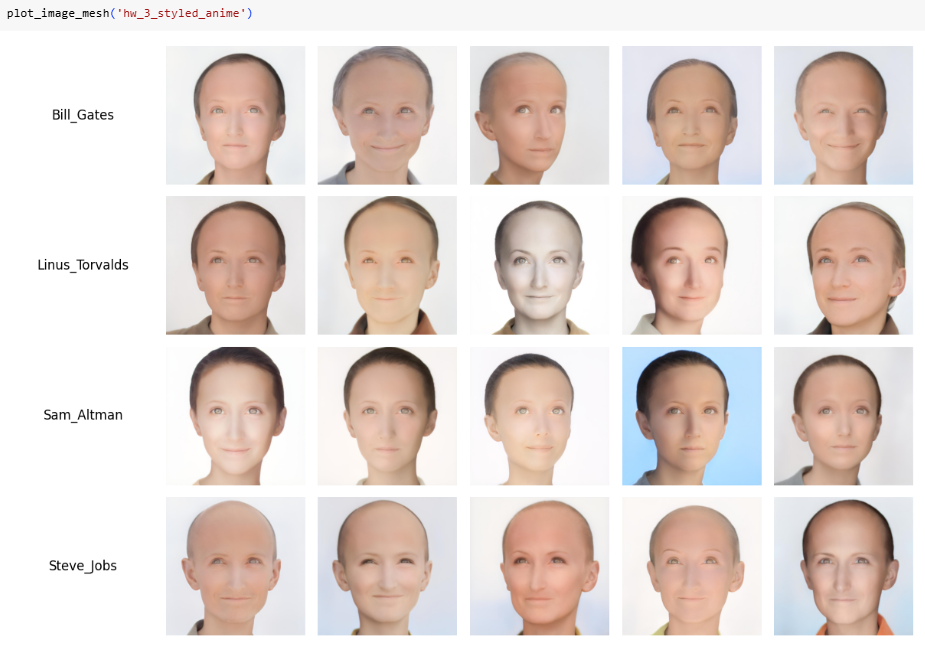
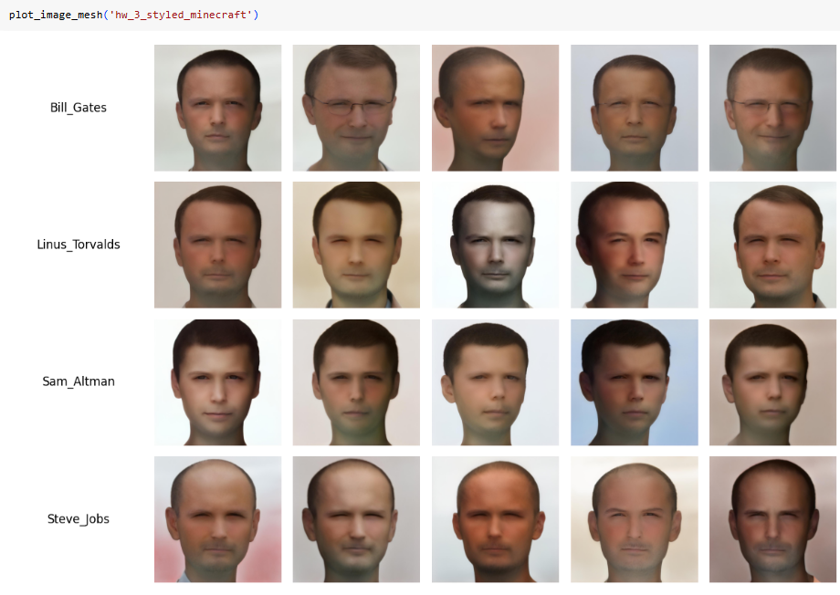
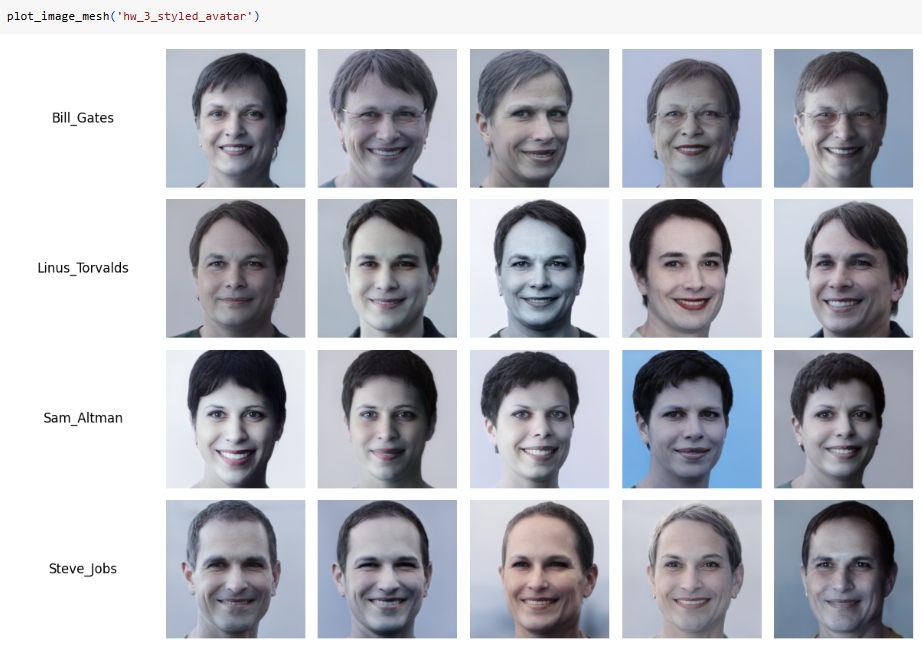
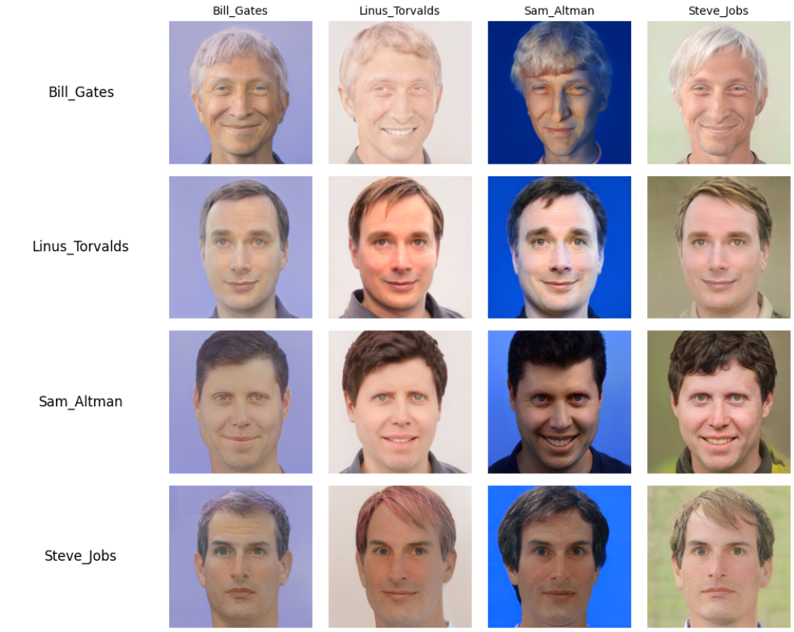

### Домашнее задание 3

Ссылка на колаб: https://colab.research.google.com/drive/1yzBd6OnT1hMdEEiT3Y7raRhBkT8RKlYA?usp=sharing

Для теста было взято 20 фотографий 4 разных людей (случайные фото из интернета). Пример картинок представлен ниже:

Исходные картинки можно скачать по ссылке: https://drive.google.com/file/d/13yErsWY0qvYjYnkd8-1-qQoC7xzhKEL2/view?usp=sharing

Далее с использованием функции из лекции изображения кадрированы:

Задача: найти оптимальную проекцию каждого изображения в пространстве GAN. Для этого использована комбинация e4e-encoder и градиентной оптимизации. Вектор, полученный после оптимизации умножался на 0.5 и складывался с вектором после e4e-encoder, также умноженным на 0.5.

В результате получились вот такие сгенерированные изображения:

Можно заметить, что вернеурновневые фичи, которые не имеют четкого контура (очки в тонкой оправе), были утеряны. Здесь можно провести аналогию с примером с AmongUS из лекции. Также можно еще раз убедиться, что GANы чувствительны к дефектам и качеству картинок, из-за которого детали были утеряны. 

Также опробовано применение стилей (исходники в папке styles):

Такие получились результаты:

Проведем замену лиц, для этого модифицируем функцию градиентной оптимизации с использованием ArcLoss. Получился вот такой результат:

В качестве целевой фотографии при смене лиц использовалась 3-я фотография для каждого персонажа из директории hw_3_my_celebs_aligned в колабе, так как у этих фото наиболее сильно отличался фон между собой. Можно увидеть, что сохранен фон для целевой фотографии, а также положение лица, при этом само лицо взято с оригинальной фотографии. 

**Вывод**:  использование комбинации e4e-encoder и градиентной оптимизации дает достаточно неплохое качество изображений (сохраняются черты лица и волосы, но пропадают мелкие детали). Метрики представлены в ноутбуке и колабе. Для их улучшения необходимы дальнейшие эксперименты, например, поменять коэффициенты при сложении векторов на побольше в сторону e4e.