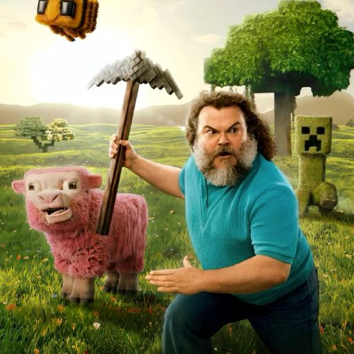
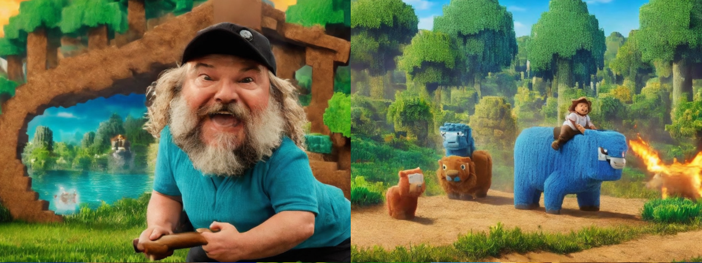
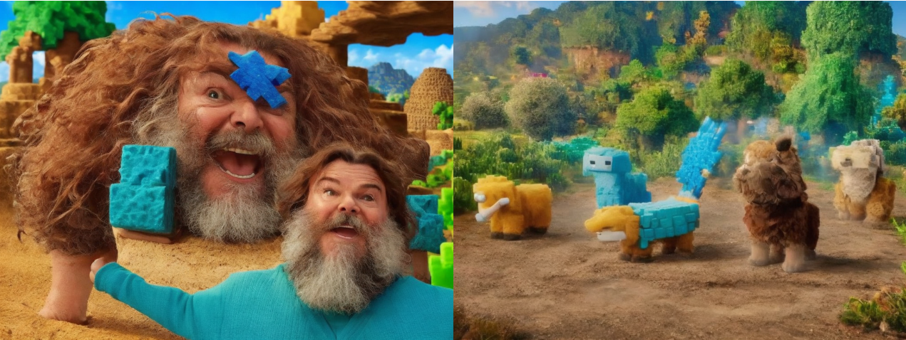
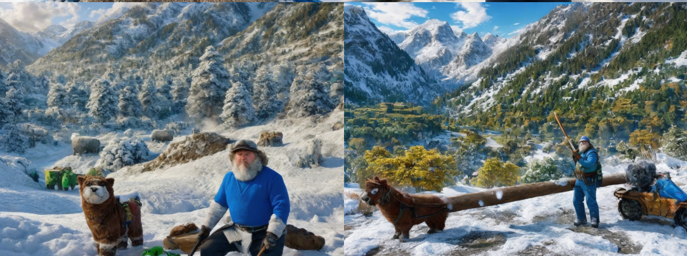
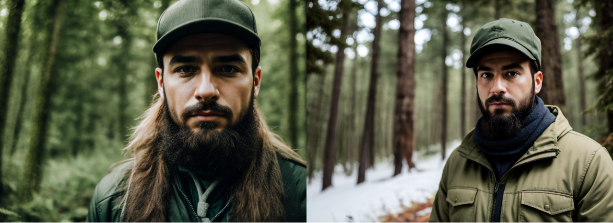
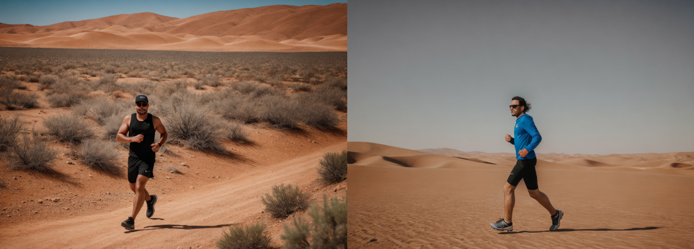
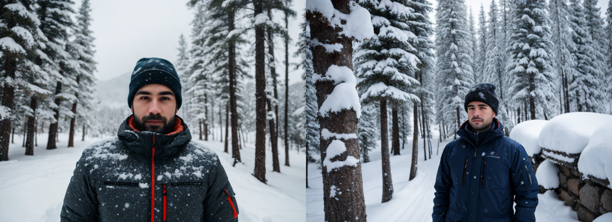

## Домашнее задание 4

Генерация изображений с помощью StableDiffusion 1.5

Ссылка на колаб: https://colab.research.google.com/drive/1aZZGUXXgTwglHaR3OonAAmRlIcS941DI?usp=sharing

В качестве instance images собрал датасет из 15 изображений данного персонажа и кадрировал их к размеру 512х512. Изображения включают различные ракурсы. Пример:



Для классовых изображений использовал автоматическую генерацию.

Далее обучил модель методом Dreambooth. Использовал scheduler='linear' и увеличил learning_rate до 2e-5.

Получил такие результаты. Для теста поменял промпты, чтобы проверить, как будут генерироваться различные ракурсы персонажа (close-up, до пояса и в отдалении).


```
promt_list = [
    {
     "name": "forest",
     "prompt":f"portrait of {token} man face, in the forest, standing, 4K, raw, hrd, hd, high quality, sharp focus",
     "n_prompt":"naked, nsfw, deformed, distorted, disfigured, poorly drawn, bad anatomy, extra limb, missing limb, floating limbs, mutated hands, disconnected limbs, mutation, ugly, blurry, amputation",
    },
    {
     "name": "desert",
     "prompt":f"middle view portrait of {token} man, in the desert, running, 4K, raw, hrd, hd, high quality, realism, sharp focus",
     "n_prompt":"naked, nsfw, deformed, distorted, disfigured, poorly drawn, bad anatomy, extra limb, missing limb, floating limbs, mutated hands, disconnected limbs, mutation, ugly, blurry, amputation",
    },
    {
     "name": "mountains",
     "prompt":f"close-up portrait of {token} man, in the mountains, snow, trees, standing, 4K, raw, hrd, hd, high quality, realism, sharp focus",
     "n_prompt":"naked, nsfw, deformed, distorted, disfigured, poorly drawn, bad anatomy, extra limb, missing limb, floating limbs, mutated hands, mutation, ugly, blurry",
    },
]
```





Здесь приведены примеры изображений, полную подборку можно посмотреть в ноутбуке.
Получилось весьма оригинально :)

Модель значительно галлюцинирует, но при этом способна генерировать человека не только в close-up, но и в других ракурсах. Также не потеряна способность генерировать фон по запросу, но на некоторых изображениях человек пропадает.

#### Обучение LoRA

Попробовал обучить LoRA со стандартным параметром rank=4. Получил следующие изображения (несколько примеров еще есть в ноутбуке):





Модель не генерирует заданного персонажа, хотя отдельные элементы присутствуют, например, борода. Значит, нужны дальнейшие эксперименты с rank